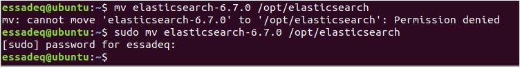

# getIntoElasticsearch

**French version** (English version is comming soon)

ElasticSearch est un projet open source développé en Java sous licence Apache2. Le projet a été présenté par son créateur, Shay Banon, comme le successeur du framework Compass (un framework de mapping objet/moteur de recherche partageant des similitudes avec Hibernate Search).

La première version a été mise à disposition du public en février 2010. Depuis, le projet tient un rythme soutenu de releases à raison d'une version tous les un ou deux mois.

[Guide elasticsearch](https://www.elastic.co/guide/en/elasticsearch/reference/master/index.html)

### Installation _Elasticseach_ v 6.7.0

La configuration de mon système:

| OS                       | RAM    | Disque  |
| ------------------------ | ------ | ------- |
| Linux Ubuntu 18.04.1 LTS | 2.5 Go | 21.0 Go |

1. Vérifier la versions de Java


Si vous avez pas Java installé sur votre system, vous pouvez l'installer par la commande

```bash
sudo apt update
sudo apt install openjdk-8-jdk openjdk-8-jre
```

2. Télecharger elasticsearch v6.7.0 (pour java 8)
   lien: `https://artifacts.elastic.co/downloads/elasticsearch/elasticsearch-6.7.0.tar.gz`


Si vous possedez une autre version de Java, vous devez installez la vesrion elasticsearch compatible:

3. Décompresser le fichier tar.gz


4. Ouvrire le fichier de coiguration`/conig/elasticseach.yml` avec le mode Root (administrateur)


5. Ajouter la coniguration au fichier de coiguration `/conig/elasticseach.yml`

conf:

```yml
cluster.name: < nom du cluster pour l’ensemble des noeuds elastic >
node.name: <nom du noeud que vous souhaitez démarrer (doit être unique pour un cluster)>
path.data: <ou stocker les données ?>
path.logs: <les logs ?>
bootstrap.memory_lock: <verrouiller la mémoire ?>
network.host: localhost
http.port: <Port http (9200)>
! action.destructive_requires_name: true
index.number_of_shards: < nombre de serveurs (défaut 1)>
index.number_of_replicas: < de serveurs de réplication pour la tolérance aux pannes (défaut 0) >
```

exemple:


6. Vérifier que vous avez ces fichier avant de continuer.


6. Déplacer et renomer le respertoir vers `/opt/elasticsearch`.



6. Ouvrire le fichier `.profile`.


6. Ajouter les variables suivants.

```bash
export ES_HOME=/opt/elasticsearch
export PATH=$PATH:$ES_HOME/bin
```


7. Charger le fichier .profile et tester par

```bash
echo $ES_HOME
```

Il faut que vous recevoire la valeure dèja citée dans .proile


8. N'oubliez pas de créer les repertoires `data/` et `log/` dans `/opt/elasticsearch`


9. Vériier les droits d'accès vers `/opt/elasticsearch/elaticseach.keystore`, et ajouter les droits de l'écriture et de l'éxecution.


10. Lancez elasticsearch


11. Verifier le lancement via `jps`


11. Tester votre premier requête `curl`


Vous avez pas `curl` ? installez le, par

```bash
sudo apt install curl
```

11. Ou bien tester la même requête dans votre navigateur.


Maintenant, Elasticsearch est bien installé.
Pour pouvoir gérer le cluster, on va utiliser une interace graphique, `elasticsearch-head`.

### Installation _elasticsearch-head_ (Optionnel)

`elasticsearch-head` est 'front-end' (une interface) faite pour gérer, visualiser, et passer des requêtes à elasticsearch.

[elasticsearch-head sur github](https://github.com/mobz/elasticsearch-head#running-with-built-in-server)

1. Installez nodejs


2. Installez npm


3. Installez Verifier votre installation


4. Faire `clone` via `git` du 'repository' : `https://github.com/mobz/elasticsearch-head#running-with-built-in-server`


5. Vous deplacez vers le dossier `elasticsearch-head`, et executer `npm install`


6. Lancez le serveur nodejs


7. N'oubliez pas de lancer elasticsearch


8. Visitez l'adresse ` http://localhost:9100/` sur votre navigateur.


9. Vous pouvez observer que on peut pas connecter au cluster via 'elasticseach-head', on peut régler ce problème on ajoutant les propiétés suivantes au fichier `elasticsearch.yml`.

```yml
http.cors.enabled: true
http.cors.allow-origin: "*"
```


10. Et voilà on est connecter à notre cluster


11. Voici les inormations de notres cluster


==FIN installation==

### Next Section [Elasticseach concepts]()
