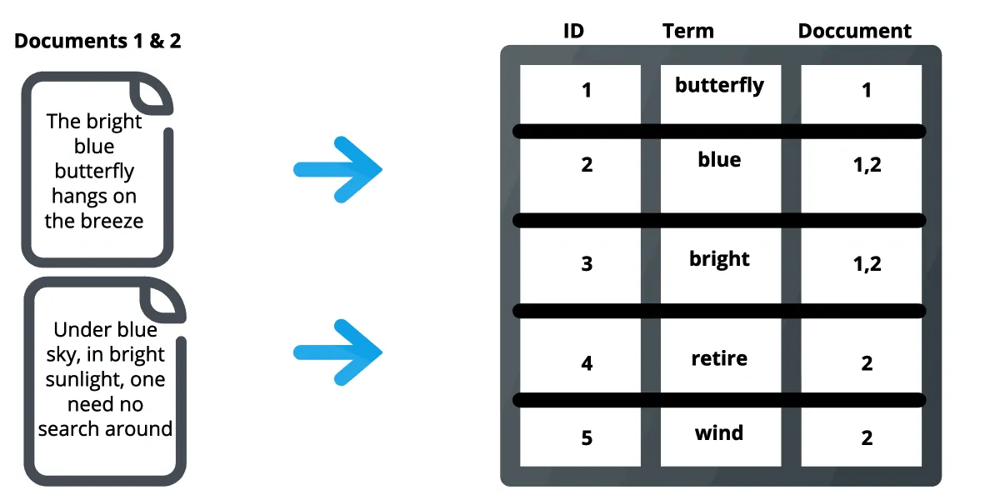

## Elasticseach, les conceptes

[:arrow_left: Revenir à l'installation](./README.md)
<i>**Elasticsearch ?**</i>

Elasticsearch est un moteur de recherche et d'analyse distribué et open-source basé sur Apache Lucene et développé en Java. Elasticsearch vous permet de stocker, de rechercher et d'analyser d'énormes volumes de données rapidement et en temps quasi réel, et de fournir des réponses en quelques millisecondes. Il est capable d'obtenir des réponses de recherche rapides parce qu'au lieu de rechercher le texte directement, il recherche dans un index. Il utilise une structure basée sur des documents plutôt que sur des tables et des schémas, et est fourni avec des API REST étendues pour le stockage et la recherche de données. Au fond, Elasticsearch est un serveur capable de traiter des requêtes JSON et de vous renvoyer des données JSON.

<i>**Comment fonctionne Elasticsearch ?**</i>

Pour mieux comprendre le fonctionnement d'Elasticsearch, nous allons aborder quelques concepts de base sur la façon dont il organise les données et ses composants back-end.

##### Les conceptes logiques

1. **Les documents (Documents).**

Les documents sont l'unité de base des informations qui peuvent être indexées dans Elasticsearch exprimées en JSON. On peut considérer un document comme une ligne (row) dans une base de données relationnelle, représentant une entité (entrée) donnée. Dans Elasticsearch, un document peut être plus qu'un simple texte, il peut s'agir de n'importe quelle donnée structurée codée en JSON. Ces données peuvent être des nombres, des chaînes de caractères et des dates. Chaque document possède un identifiant unique et un type de données, qui décrit le type d'entité que représente le document. Par exemple, un document peut représenter un article.  

2. **Les indices (Indices).**

Un index est une collection de documents qui ont des caractéristiques similaires. Un index est l'entité de plus haut niveau sur laquelle vous pouvez effectuer des requêtes dans Elasticsearch. On peut considérer que l'index est similaire à une base de données dans un schéma de base de données relationnelle. Tous les documents d'un index sont généralement liés logiquement. Dans le contexte d'un site de commerce électronique, par exemple, vous pouvez avoir un index pour les clients, un pour les produits, un pour les commandes, et ainsi de suite. Un index est identifié par un nom qui est utilisé pour faire référence à l'index lors des opérations d'indexation, de recherche, de mise à jour et de suppression des documents qu'il contient. 

3. **Les indices inversés (Inverted indices).**

C'est le mécanisme par lequel tous les moteurs de recherche fonctionnent. Il s'agit d'une structure de données qui stocke une correspondance entre le contenu, tel que des mots ou des chiffres, et son emplacement dans un document ou un ensemble de documents. En gros, il s'agit d'une structure de données de type hashmap qui vous dirige d'un mot vers un document. Un index inversé ne stocke pas directement les chaînes de caractères, mais divise chaque document en termes de recherche individuels (c'est-à-dire chaque mot), puis associe chaque terme de recherche aux documents dans lesquels il apparaît. Par exemple, dans l'image ci-dessous, le terme "best" apparaît dans le document 2, il est donc associé à ce document. Cela permet de savoir rapidement où trouver les termes recherchés dans un document donné. En utilisant des indices inversés distribués, Elasticsearch trouve rapidement les meilleures correspondances pour les recherches en texte intégral, même dans des ensembles de données très volumineux.

##### Les composants backend

1. **Cluster**

Un cluster Elasticsearch est un groupe d'une ou plusieurs instances de nœuds qui sont connectées entre elles. La puissance d'un cluster Elasticsearch réside dans la distribution des tâches, la recherche et l'indexation, sur tous les nœuds du cluster.

1. **Node**

Un nœud est un serveur unique qui fait partie d'un cluster. Un nœud stocke des données et participe aux capacités d'indexation et de recherche du cluster. Un nœud Elasticsearch peut être configuré de différentes manières :
Master Node, Data Node, Client Node

| Master Node                                                                                                                                                                     | Data Node                                                                                               | Client Node                                                                                             |
| ------------------------------------------------------------------------------------------------------------------------------------------------------------------------------- | ------------------------------------------------------------------------------------------------------- | ------------------------------------------------------------------------------------------------------- |
| Contrôle le cluster Elasticsearch et est responsable de toutes les opérations à l'échelle du cluster, comme la création/suppression d'un index et l'ajout/suppression de nœuds. | Stocke les données et exécute les opérations liées aux données telles que la recherche et l'agrégation. | Transmet les demandes de cluster au nœud maître et les demandes liées aux données aux nœuds de données. |

1. **Shards**

Elasticsearch offre la possibilité de subdiviser l'index en plusieurs morceaux appelés shards. Chaque shard est en soi un "index" entièrement fonctionnel et indépendant qui peut être hébergé sur n'importe quel nœud d'un cluster. En répartissant les documents d'un index sur plusieurs shards, et en répartissant ces shards sur plusieurs nœuds, Elasticsearch peut assurer la redondance, ce qui permet à la fois de se protéger contre les pannes matérielles et d'augmenter la capacité de requête lorsque des nœuds sont ajoutés à un cluster.

1. **Replicas**

Elasticsearch nous permet de faire une ou plusieurs copies des shards de notre index, appelées "replica shards" ou simplement "replicas". Fondamentalement, un replica shard est une copie d'un shard primaire. Chaque document dans un index appartient à un shard primaire. Les répliques fournissent des copies redondantes de nos données afin de nous protéger contre les pannes matérielles et d'augmenter la capacité de traitement des requêtes de lecture telles que la recherche ou la récupération d'un document.

#### Qu'est-ce que Elastic Slack [(ELK stack)](https://www.elastic.co/what-is/elk-stack) ?

Elastic Slack est un écosystème complet d’outils open-source pour l’ingestion, l’enrichissement, le stockage, l’analyse et la visualisation de données. Outre Elasticsearch, les autres logiciels sont Logstash, Kibana et Beats.

// à faire

- [ ] Définitions (Logstash, Kibana et Beats)

[:arrow_left: Revenir à l'installation](./README.md)

### Next Section: [Fonctionement & interaction :arrow_right:](./concepts.md)
