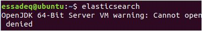
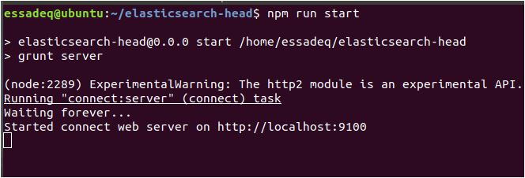
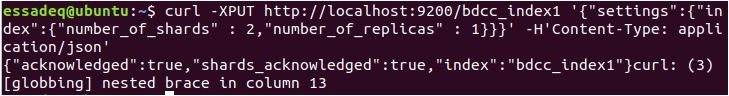
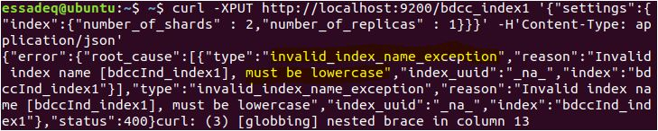
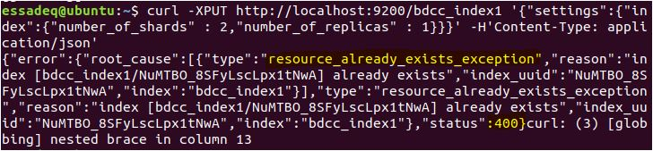
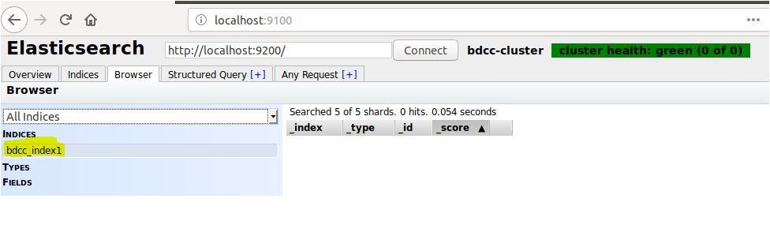
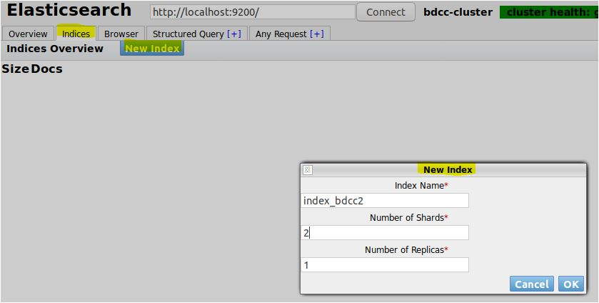
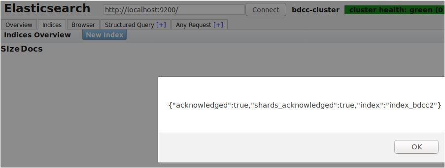
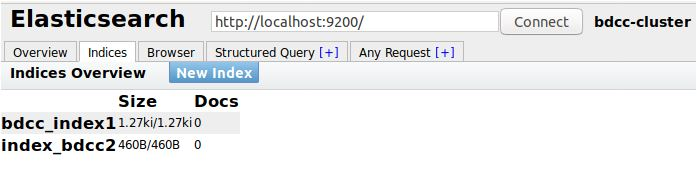

## Elasticseach, le fonctionnement

[:arrow_left: Revenir au concepts](./README.md)

## Opérations basic [CLI avec curl]

**Lancez elasticsearch et elasticsearch-head (pour la visualisation)**





#### Création d'un index

La première opération à effectuer avant de commencer à indexer des données dans Elasticsearch est de créer un index - le conteneur principal de nos données.

Un index est similaire au concept de base de données en SQL, un conteneur pour les types (tables en SQL) et les documents (enregistrements en SQL).

the HTTP method to create an index is PUT (but also POST works); the REST URL contains the index name:

`http://<server>/<index_name>`

**Création d'un Index**

```bash
curl -XPUT http://localhost:9200/bdcc_index1 '{"settings":{"index":{"number_of_shards" : 2,"number_of_replicas" : 1}}}' -H'Content-Type: application/json'

```

Resultat :



L'option `-H'Content-Type: application/json'` est important pour spécifier le type de contenue de la requête: plus d'information sur ([plus d'informations ? :hand:](https://www.elastic.co/blog/strict-content-type-checking-for-elasticsearch-rest-requests))

Exemple d'erreur dans le nom de l'index :



Si l'Index exist déja, la commande va générer une erreur `404`.



**Noter**: Comme le nom de l'index sera mappé sur un répertoire de votre stockage, il y a quelques limitations au nom de l'index, et les seuls caractères acceptés sont :

- les lettres ASCII [a-z]
- Chiffres [0-9]
- Point ".", moins "-", "&" et "\_".

Pendant la création de l'index, la réplication peut être définie avec deux paramètres dans l'objet settings/index :

- number_of_shards, qui contrôle le nombre de shards qui composent l'index (chaque shard peut stocker jusqu'à 2^32 documents)
- number_of_replicas, qui contrôle le nombre de répliques (combien de fois vos données sont répliquées dans le cluster pour une haute disponibilité). Une bonne pratique consiste à fixer cette valeur à au moins 1.
  L'appel API initialise un nouvel index, ce qui signifie :

- L'index est d'abord créé dans un nœud primaire, puis son statut est propagé à tous les nœuds du niveau cluster.
- Un mappage par défaut (vide) est créé
- Tous les shards requis par l'index sont initialisés et prêts à accepter des données.

On peut voir l'index par `elsticsearch-head`



**Création d'un index en utilisant elsticsearch-head**







[//]: <> (This is a comment )
[comment]: <> (This is a comment )

**Suppression d'un index**

La suppression d'un index signifie la suppression de ses shards, mappings et données.

```bash
curl -XDELETE http://localhost:9200/bdcc1_index
```

Resultat:


Si l'index n'existe pas, la commande génère une erreur `404`.

Lorsqu'un index est supprimé, toutes les données liées à cet index sont supprimées du disque et sont perdues.

Il n'est pas possible de restaurer un index supprimé, s'il n'y a pas de sauvegarde.

L'appel à l'aide de la commande spéciale \_all index_name peut également être utilisé pour supprimer tous les index. En production, il est recommandé de désactiver la suppression de tous les index en ajoutant la ligne suivante à Elasticsearch.yml :

```properties
action.destructive_requires_name:true

```

**Ouverture/fermeture d'un index**

Si vous souhaitez conserver vos données, mais économiser des ressources (mémoire/CPU), une bonne alternative à la suppression des index est de les fermer.

Elasticsearch vous permet d'ouvrir/fermer un index pour le mettre en mode en ligne/hors ligne.

Depuis la ligne de commande, nous pouvons exécuter un appel POST pour fermer un index en utilisant :

```bash
curl -XPOST http://localhost:9200/bdcc1_index/_close
```

Resultat is l'opération est faite avec succès:

```json
{ "acknowledged": true }
```

Pour ouvrir un index, à partir de la ligne de commande, tapez la commande suivante :

```bash
curl -XPOST http://localhost:9200/bdcc1_index/_open
```

Lorsqu'un index est fermé, il n'y a pas de surcharge sur le cluster (sauf pour l'état des métadonnées) : les taches d'index sont désactivées et n'utilisent pas de descripteurs de fichiers, de mémoire et de threads.

Lorsqu'un index est fermé, l'appel de l'ouverture restaure son état.

**Mettre un mapping dans un index**
Un mapping de type dans un index peut être considéré comme la version Elasticsearch d'une table créée en SQL.

La méthode HTTP pour placer un mappage est PUT (POST fonctionne également).

Le format de l'URL pour mettre un mapping est :

`http://<serveur>/<nom_index>/<nom_type>/_mapping`

```bash
curl -XPUT 'http://localhost:9200/bdcc1_index/order/_mapping' -d '{

   "order" : {

       "properties" : {

           "id" : {"type" : "keyword", "store" : "yes"},

           "date" : {"type" : "date", "store" : "no" , "index":"not_analyzed"},

           "customer_id" : {"type" : "keyword", "store" : "yes"},

           "sent" : {"type" : "boolean", "index":"not_analyzed"},

           "name" : {"type" : "text", "index":"analyzed"},

           "quantity" : {"type" : "integer", "index":"not_analyzed"},

           "vat" : {"type" : "double", "index":"no"}

       }

   }

    }'

```

Cet appel vérifie si l'index existe, puis il crée un ou plusieurs mappings de type comme décrit dans la définition.

Pendant l'insertion du mappage, s'il existe un mappage existant pour ce type, il est fusionné(merged) avec le nouveau. S'il existe un champ avec un type différent et que le type n'a pas pu être mis à jour, une exception d'expansion de la propriété des champs est levée (expanding fields property). Pour éviter une exception pendant la phase de fusion du mapping, il est possible de spécifier le paramètre ignore_conflicts à true (false par défaut).

**Noter:**
Il n'existe pas d'opération de suppression pour les mappings. Il n'est pas possible de supprimer un seul mapping d'un index. Pour supprimer ou modifier un mapping, vous devez gérer les étapes suivantes :

1. Créer un nouvel index avec le mapping nouveau/modifié.
2. Réindexer tous les enregistrements
3. Supprimer l'ancien index avec le mapping incorrect

[:arrow_left: Revenir au concepts](./README.md)

### Next Section: [Comming soon:arrow_right:](./concepts.md)
